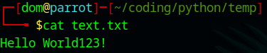

# ASCII-TOOL
Python tool for converting ASCII to text and test to ASCII

## Table of Contents

- [Installation](#installation)
- [Tutorial](#tutorial)
- [Tested Platforms](#testedon)

## Installation

1. Clone the repository:
   ```bash
   git clone https://github.com/username/repository.git
2. Change directory:
   ```bash
   cd ./ASCII-TOOL
3. Run the script:
   ```bash
   python3 ASCII-TOOL.py

## Tutorial


## Tested Platforms

1. Tested on:
   Linux Parrot OS
    
   
