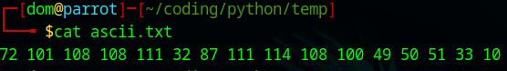
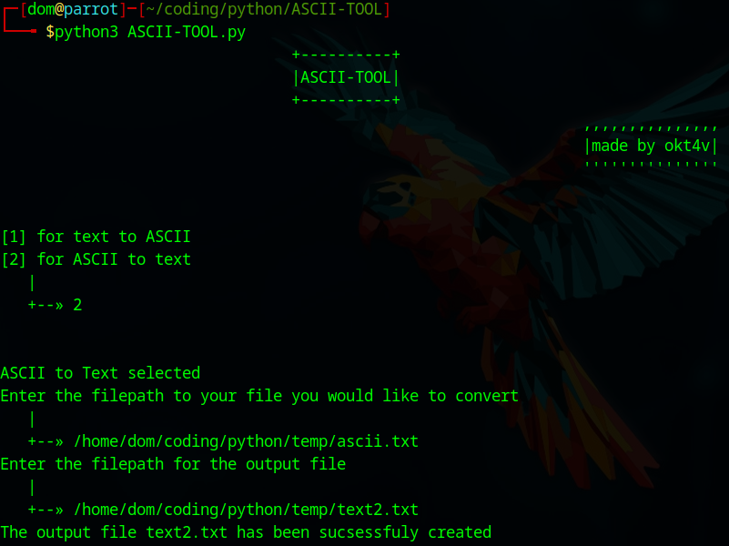
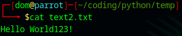

# ASCII-TOOL
Python tool for converting ASCII to text and text to ASCII

## Table of Contents

- [!DISCLAIMER!](#disclaimer)
- [Installation](#installation)
- [Tutorial](#tutorial)
- [Future Updates](#futureupdates)
- [Tested Platforms](#testedon)

## !DISCLAIMER!
   
   This is in no ways meant to be anything impressive, just practicing some skills thats all!

## Installation

1. Clone the repository:
   ```bash
   git clone https://github.com/username/repository.git
2. Change directory:
   ```bash
   cd ./ASCII-TOOL
   ```bash
   pip install requirements.txt
4. Run the script:
   ```bash
   python3 ASCII-TOOL.py

## Tutorial
1. This is the file we are going to convert to ASCII.

	

2. Run ASCII-TOOL.py, select mode 1 for Test to ASCII, enter the filepath to the file you would like to convert enter the path to the output file that will be created.

	

3. Open the file that has been created to verify its success.

   

4. Now we run ASCII-TOOL.py but specify mode 2 for ASCII to text, enter the filepath to the file you would like to convert and enter the filepath for the new output file.

   

5. Open the file and verify that it has successfuly been converted.

   

## Future Updates

In the future I am planning on adding a couple of new things and improving some already existing things:
   
   1. Improve overall code logic for better performance
   2. Improve terminal user interface (colors, layout, ...)
   3. Improve error handling
   4. Add command line arguments for quick and easy access to the tool without the terminal user interface 


## Tested Platforms

	- Linux (Parrot OS)
    
   
